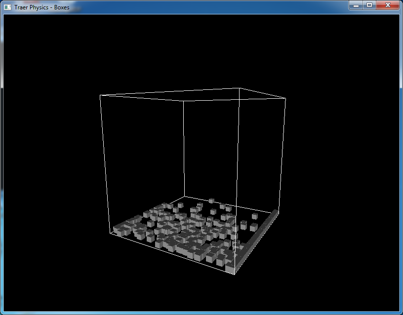
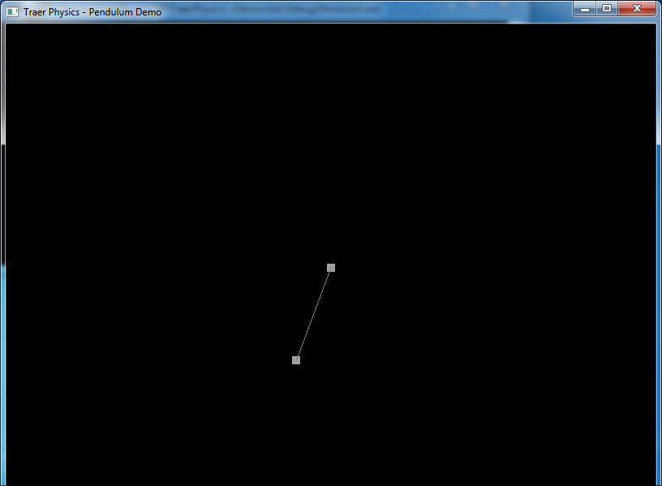

TraerPhysicsCPP
===============

This is the C++ port of the Processing Traer Physics Library by Jeff. The original processing library can be obtained from http://murderandcreate.com/physics/. 

Project Dependencies
====================
The project requires two libraries
1) Freeglut (latest version)
   As of this writing, the latest freeglut version is v 2.8.1 which may be obtained from http://freeglut.sourceforge.net/index.php#download
2) glm maths library (latest version)
   As of this writing, the latest glm version is v 0.9.5.3 which may be obtained from http://glm.g-truc.net/0.9.5/index.html. I used v 0.9.4.6 but the code should run without a problem with the latest glm library.
   
Compiling the library
=====================
After downloading, unzip freeglut and glm libraries to a common folder. I usually put all my libraries in a common Libraries folder. Then open the freeglut project in VisualStudio and build the freeglut librar on your machine. There is no need to build glm as it is a headers only library. Next, create an environment variable LIBRARIES_ROOT that points to the Libraries root folder. Then, open the VisualStudio 2012 project file TraerPhysics.sln in the TraerPhysics folder on the root. Compile and run and it should compile and run fine. Demo projects are located in the Demos directory. Open the corresponding project for details.

Demo Screenshots
================
Here are a few snapshots of demos made with this library.

Balls:

Box:

Cloth:

Cloud:

Pendulum:

RandomArboretum:

Tendrils:

Comments/Corrections/Feedback
=============================
If you have made any new interesting demos, please share them with me by either forking it or email me at mova0002[at]e[dot]ntu[dot]edu[dot]sg

Enjoy !!!

